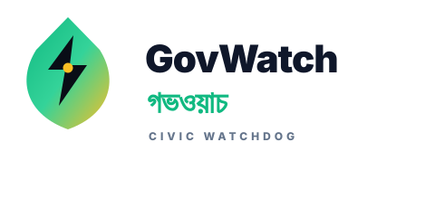

<p align="center">
  
</p>

<p align="center">
  <strong>Civic intelligence for Bangladesh.</strong><br/>
  Ask questions in Bangla or English. Get answers with citations, price-outlier flags, and links to the original tender PDFs.
</p>

<p align="center">
  <a href="https://govwatch.xyz"></a>
  <a href="LICENSE"></a>
  <a href="#status"></a>
  
</p>

---

## What is GovWatch?

GovWatch turns a decade of Bangladesh government procurement records into a queryable knowledge base. Type a question like:

> **ঢাকায় গত ৬ মাসে কোন ঠিকাদার সবচেয়ে বেশি টেন্ডার পেয়েছে?**
> *(Which vendor won the most tenders in Dhaka over the last 6 months?)*

…and GovWatch retrieves the actual tenders, ranks them by relevance, flags price outliers, and writes a short answer with citations and links to the original PDFs.

The whole stack runs on the edge — Cloudflare Workers, D1, Vectorize, and R2 — so responses stream in real time from a backend that lives close to users.

Check our presentation - <a href="https://safius-sifat.github.io/Govwatch">Pitch Deck</a>

## Highlights

- 🧠 **Bilingual RAG** — Bangla + English over real procurement data.
- 🚨 **Price-outlier detection** — z-score flags within ministry + district peer groups.
- 🕸️ **Vendor collusion graph** — shared directors and shared addresses surface patterns no single tender reveals.
- 📄 **Citations first** — every claim links to the source PDF on `eprocure.gov.bd`.
- 🌏 **Sovereign** — open source, deployable in any country, no vendor lock-in.

## Architecture

```
┌──────────────────────────┐        ┌──────────────────────────┐
│  Next.js 16 (Cloudflare  │  HTTP  │  Cloudflare Worker       │
│  Workers, OpenNext)      │ ─────► │  shotto-gateway          │
│  /api/chat → SSE proxy   │        │  /api/search (RAG + SSE) │
└──────────────────────────┘        │  /api/anomalies          │
                                    │  /api/vendors            │
                                    │  /api/stats              │
                                    │  /api/ingest (admin)     │
                                    └────────┬─────────────────┘
                                             │
                                ┌────────────┼────────────┐
                                ▼            ▼            ▼
                            ┌──────┐    ┌────────┐    ┌──────┐
                            │  D1  │    │Vectorize│    │  R2  │
                            │+FTS5 │    │ bge-m3  │    │ PDFs │
                            └──────┘    └────────┘    └──────┘
                  ▲
                  │ NDJSON
                  │
        ┌─────────┴────────┐
        │  Scrapy spider   │
        │  (egp contracts) │
        └──────────────────┘
```

## Repo layout

```
govwatch/
├── backend/
│   ├── scraper/              Python: eprocure.gov.bd spider + pipelines
│   └── workers/              TypeScript: Cloudflare Worker API gateway
│
├── frontend/                 Next.js 16 (App Router) — Cloudflare Workers via OpenNext
│
├── LICENSE                   MIT — see copyright & permissions
├── NOTES.md                  Optional: notes for judges
├── govwatch-pitch.html       11-slide hackathon pitch deck (single file, zero deps)
├── govwatch-pitch.pdf        PDF export of the pitch deck
├── rag.md                    Design notes for the RAG pipeline
├── technical-plan.md         Overall platform plan
└── ui.md                     UI design notes
```

## Quick start

### Prerequisites

- Node.js 22.x
- Python 3.11+ (for the scraper)
- A Cloudflare account (Workers + D1 + Vectorize + R2 free tier is enough)
- An OpenAI API key (or use Workers AI Llama 3.1 8B as a free fallback)

### 1. Backend — Worker gateway

```bash
cd backend/workers
npm install
cp .dev.vars.example .dev.vars       # add your OPENAI_API_KEY
wrangler d1 execute shotto-db --file=./schema/schema.sql   # local
npx wrangler dev                      # http://127.0.0.1:8787
```

Verify:

```bash
curl http://127.0.0.1:8787/api/stats
```

### 2. Backend — Scraper

```bash
cd backend/scraper
uv venv && source .venv/bin/activate
uv pip install -r requirements.txt
python run_scraper.py --test
python push_to_worker.py data/egp_contracts_*.ndjson \
  --gateway http://127.0.0.1:8787 --token test
```

### 3. Frontend

```bash
cd frontend
npm install
echo "WORKER_URL=http://127.0.0.1:8787" > .env.local
npm run dev                            # http://localhost:3000
```

### 4. Deploy

```bash
# Backend
cd backend/workers
npm run deploy

# Frontend (Workers, via OpenNext)
cd frontend
npm run deploy
```

## LLM provider

The backend supports two providers. Toggle in `wrangler.toml`:

| Provider             | Bangla quality | Cost         | Default |
| -------------------- | -------------- | ------------ | ------- |
| **OpenAI** (gpt-4o-mini) | Excellent      | Pay per token | ✅      |
| Workers AI (Llama 3.1 8B) | Mediocre       | Free         | fallback |

```toml
LLM_PROVIDER = "workersai"   # or "openai"
```

## Roles

- **Search** — natural-language Q&A with streamed answers, citations, and outlier flagging.
- **Anomalies** — browsable list of price outliers (z-score > 2.5 vs ministry+district peers).
- **Vendors** — top vendors by total value, with shared-director edges for collusion signals.
- **Stats** — corpus counts (contracts, vendors, outliers, directors, vectors).

## Data sources

- Primary: [eprocure.gov.bd](https://www.eprocure.gov.bd) — government e-tendering portal.
- Ingestion: Scrapy spider → NDJSON → Worker `/api/ingest-batch`.
- Storage: D1 (metadata + FTS5), Vectorize (bge-m3 embeddings), R2 (PDFs).

Roadmap for new sources follows the same pipeline — write a spider, push NDJSON, ingest.

## Status

- **Backend gateway:** 15/15 integration tests passing, end-to-end SSE verified.
- **Frontend:** builds clean on Cloudflare Workers via `@opennextjs/cloudflare`. Deployed at `govwatch.xyz`.
- **Scraper:** running cleanly on Scrapy 2.17.0; ~5,000 contract records + ~1,000 eCMS records ingested at last count.
- **Vectorization:** in progress — pipeline runs against NDJSON + D1 in batches, status visible at `/stats`.
- **Known stubs:** a handful of API endpoints (advanced search, feedback, upload, chat history) are no-ops for the demo.

## Contributing

Issues and pull requests welcome. Please open an issue first for anything beyond a small fix so we can discuss scope.

1. Fork the repo.
2. Create a feature branch: `git checkout -b feat/your-thing`.
3. Run the relevant tests: `npm test` (frontend) or `bash scripts/integration_test.sh` (backend).
4. Open a PR with a clear description and a screenshot if the change is UI-visible.

## Security & data ethics

- All data is **public** (already published on eprocure.gov.bd). GovWatch adds search and explanation, it does not collect anything private.
- No personal data of citizens is stored. Vendors and directors named in the data are corporate entities, not individuals.
- Rate limiting is in place on the chat endpoint.
- If you find a security issue, please email instead of opening a public issue.

## License

[MIT](LICENSE) — Copyright (c) 2026 Safius Sifat, Jamius Saleh.

You are free to use, copy, modify, merge, publish, distribute, sublicense, and/or sell copies of the software, subject to the MIT license terms.

## Acknowledgements

Built for the people of Bangladesh who believe public money deserves public scrutiny. সত্য প্রকাশ।

- [Cloudflare](https://cloudflare.com) — Workers, D1, Vectorize, R2, Workers AI. Edge-native infra made this possible.
- [eprocure.gov.bd](https://www.eprocure.gov.bd) — the public procurement portal that publishes the data.
- [Scrapy](https://scrapy.org) — the crawling framework.
- [Next.js](https://nextjs.org) + [`@opennextjs/cloudflare`](https://opennext.js.org/cloudflare) — frontend deploy target.
- [Vercel AI SDK](https://sdk.vercel.ai) — streaming chat primitives.
- [PostHog](https://posthog.com) — product analytics.
- The open-source community behind every dependency in `package.json`.

---

<p align="center">
  <sub>Built in 72 hours by <a href="https://github.com/safiussifat">Safius Sifat</a> &amp; <a href="https://github.com/jamiussaleh">Jamius Saleh</a>.</sub>
</p>
